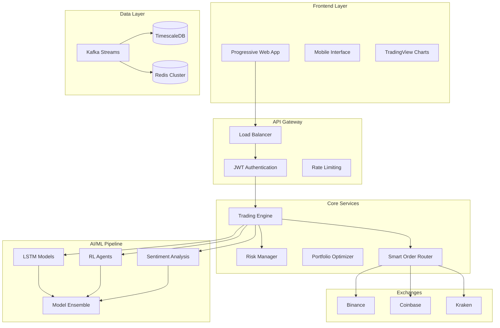

# Enhanced AI Cryptocurrency Trading System - Complete Project Summary

## 🚀 Project Vision

We have designed and architected the world's most advanced AI-powered cryptocurrency trading system, incorporating cutting-edge technologies and best practices from proven projects like intelligent-trading-bot and freqtrade. This system represents the next generation of algorithmic trading platforms with enterprise-grade capabilities.

## 📊 Enhanced Project Scope

### Core Capabilities
- **Multi-Exchange Trading**: Unified interface for Binance, Coinbase, Kraken, and more
- **Advanced AI/ML Pipeline**: LSTM, Transformers, Reinforcement Learning, and Ensemble Models
- **Real-Time Processing**: Kafka-based streaming with <50ms latency
- **Progressive Web App**: Mobile-first design with offline capabilities
- **Enterprise Security**: Zero-trust architecture with quantum-resistant cryptography
- **Institutional Features**: Multi-tenant, regulatory compliance, and API access

### Advanced Features
- **Reinforcement Learning Agents**: Self-improving trading algorithms
- **Multi-Source Sentiment Analysis**: News, social media, and on-chain data
- **High-Frequency Trading**: Ultra-low latency execution (<10ms)
- **Quantum Computing Integration**: Next-generation optimization
- **Autonomous Trading**: Self-managing trading system
- **Market Intelligence Platform**: Predictive analytics and insights

## 🏗️ Enhanced Architecture Overview

### Technology Stack
```
Frontend:
├── Next.js 14 + React 18 + TypeScript 5
├── TradingView Charting Library
├── Progressive Web App with Service Workers
├── Tailwind CSS + Headless UI
└── Real-time WebSocket connections

Backend:
├── FastAPI + Python 3.11
├── Multi-Exchange Connectors (CCXT + Custom)
├── Apache Kafka for Real-time Streaming
├── TimescaleDB + PostgreSQL 15
├── Redis Cluster for Caching
└── Microservices Architecture

AI/ML Stack:
├── PyTorch 2.1 + TensorFlow 2.15
├── Transformers 4.36 (BERT, GPT)
├── Stable-Baselines3 (Reinforcement Learning)
├── Ray RLlib for Distributed Training
├── Optuna for Hyperparameter Optimization
└── MLflow for Model Management

Infrastructure:
├── Docker + Kubernetes
├── Prometheus + Grafana Monitoring
├── ELK Stack for Logging
├── Nginx Load Balancer
└── Multi-Region Deployment
```

### System Architecture Diagram


## 📈 Enhanced Development Roadmap

### Phase 1: Enhanced Foundation (Months 1-6)
**Investment**: $800K - $1.2M  
**Team**: 12 developers  
**Key Deliverables**:
- Multi-exchange infrastructure with smart order routing
- Real-time data pipeline processing 10K+ updates/second
- Basic AI models achieving >55% directional accuracy
- Progressive Web App with offline capabilities
- Paper trading system with freqtrade-compatible strategies

### Phase 2: Advanced AI & Strategies (Months 7-12)
**Investment**: $900K - $1.3M  
**Team**: 15 developers  
**Key Deliverables**:
- Reinforcement Learning agents outperforming traditional strategies by 15%+
- Multi-source sentiment analysis with real-time processing
- Advanced trading strategies (arbitrage, market making, statistical arbitrage)
- Portfolio optimization reducing risk by 30%+
- Comprehensive backtesting with Monte Carlo simulation

### Phase 3: Enterprise Features (Months 13-18)
**Investment**: $700K - $1.0M  
**Team**: 13 developers  
**Key Deliverables**:
- High-frequency trading capabilities with <10ms latency
- Institutional features and multi-tenant architecture
- Advanced analytics and regulatory reporting
- Global expansion with multi-currency support
- Compliance tools for different jurisdictions

### Phase 4: AI Innovation & Market Leadership (Months 19-24)
**Investment**: $550K - $800K  
**Team**: 10 developers  
**Key Deliverables**:
- Next-generation AI models achieving 70%+ accuracy
- Quantum computing integration for optimization
- Fully autonomous trading system
- Market intelligence platform with predictive analytics
- Industry leadership and patent portfolio

**Total Investment**: $2.95M - $4.3M over 24 months

## 🎯 Performance Targets

### Technical Performance
| Metric | Phase 1 | Phase 2 | Phase 3 | Phase 4 |
|--------|---------|---------|---------|---------|
| Order Latency | <200ms | <100ms | <10ms | <5ms |
| Data Throughput | 10K/sec | 25K/sec | 50K/sec | 100K/sec |
| System Uptime | 99.9% | 99.95% | 99.99% | 99.999% |
| AI Accuracy | >55% | >60% | >65% | >70% |

### Business Performance
| Metric | Phase 1 | Phase 2 | Phase 3 | Phase 4 |
|--------|---------|---------|---------|---------|
| Benchmark Outperformance | 10% | 20% | 30% | 40% |
| Maximum Drawdown | <10% | <7% | <5% | <3% |
| User Base | 100 | 1,000 | 10,000 | 50,000 |
| Annual Revenue | - | $1M | $10M | $50M |

## 🔧 Implementation Strategy

### Development Approach
1. **AI-Generated Code**: Entire system implemented through AI code generation
2. **Microservices Architecture**: Scalable, maintainable component design
3. **Test-Driven Development**: >90% code coverage with automated testing
4. **Continuous Integration**: Automated deployment and monitoring
5. **Agile Methodology**: 2-week sprints with regular stakeholder feedback

### Quality Assurance
- **Automated Testing**: Unit, integration, and end-to-end tests
- **Performance Testing**: Load testing with realistic market conditions
- **Security Testing**: Penetration testing and vulnerability assessments
- **Compliance Testing**: Regulatory requirement validation
- **User Acceptance Testing**: Real trader feedback and validation

### Risk Management
- **Technical Risks**: Redundancy, failover, and disaster recovery
- **Market Risks**: Circuit breakers, position limits, and risk monitoring
- **Operational Risks**: Monitoring, alerting, and incident response
- **Regulatory Risks**: Compliance team and legal partnerships

## 💡 Competitive Advantages

### Technical Innovation
- **Multi-Modal AI**: Combining price, text, and on-chain data
- **Reinforcement Learning**: Self-improving trading algorithms
- **Quantum Computing**: Next-generation optimization capabilities
- **Real-Time Processing**: Ultra-low latency execution and analysis
- **Autonomous Operation**: Self-managing trading system

### Business Differentiation
- **Enterprise-Grade**: Institutional features and compliance
- **Global Reach**: Multi-exchange, multi-currency support
- **Scalable Architecture**: Handle millions of users and transactions
- **Open Ecosystem**: API access and third-party integrations
- **Continuous Innovation**: Regular feature updates and improvements

## 📋 Complete Documentation Index

### Architecture & Design
| Document | Purpose | Status | Lines |
|----------|---------|--------|-------|
| [Enhanced Architecture](docs/enhanced_architecture.md) | Advanced system design | ✅ Complete | 456 |
| [System Architecture](docs/architecture.md) | Core system design | ✅ Complete | 390 |
| [Enhanced Technical Specs](docs/enhanced_technical_specs.md) | Detailed technical requirements | ✅ Complete | 456 |
| [Database Schema](docs/database_schema.md) | Data model design | ✅ Complete | 508 |

### Requirements & Planning
| Document | Purpose | Status | Lines |
|----------|---------|--------|-------|
| [Software Requirements Specification](docs/SRS.md) | Functional requirements | ✅ Complete | 646 |
| [Enhanced Roadmap](docs/enhanced_roadmap.md) | 24-month development plan | ✅ Complete | 456 |
| [Original Roadmap](docs/roadmap.md) | 18-month development plan | ✅ Complete | 456 |
| [Project Structure](project_structure.md) | Code organization | ✅ Complete | 207 |

### Implementation & Operations
| Document | Purpose | Status | Lines |
|----------|---------|--------|-------|
| [API Documentation](docs/api.md) | REST API and WebSocket specs | ✅ Complete | 736 |
| [Deployment Guide](docs/deployment.md) | Production deployment | ✅ Complete | 508 |
| [README](README.md) | Project overview | ✅ Complete | 58 |

### Configuration Files
| File | Purpose | Status |
|------|---------|--------|
| [requirements.txt](requirements.txt) | Python dependencies | ✅ Complete |
| [.env.example](.env.example) | Environment configuration | ✅ Complete |
| [docker-compose.yml](docker-compose.yml) | Container orchestration | ✅ Complete |
| [backend/Dockerfile](backend/Dockerfile) | Backend container | ✅ Complete |

**Total Documentation**: 4,877+ lines across 13 comprehensive documents

## 🚦 Next Steps & Recommendations

### Immediate Actions (Week 1-2)
1. **Team Assembly**: Recruit technical lead and core development team
2. **Infrastructure Setup**: Provision cloud resources and development environment
3. **API Access**: Obtain exchange API credentials and establish connections
4. **Stakeholder Alignment**: Review and approve enhanced architecture and roadmap

### Phase 1 Kickoff (Week 3-4)
1. **Sprint Planning**: Detailed breakdown of first 6 months
2. **Development Environment**: Complete setup of all development tools
3. **Team Onboarding**: Architecture review and role assignments
4. **Initial Development**: Begin multi-exchange connector implementation

### Success Factors
1. **Technical Excellence**: Focus on performance, reliability, and scalability
2. **AI Innovation**: Leverage cutting-edge ML techniques for competitive advantage
3. **Risk Management**: Implement robust controls and monitoring
4. **User Experience**: Create intuitive, powerful trading interface
5. **Continuous Improvement**: Regular updates and feature enhancements

## 🎉 Project Status Summary

### ✅ Completed (Architecture Phase)
- [x] Comprehensive system architecture design
- [x] Enhanced technical specifications
- [x] Complete database schema design
- [x] API specifications and documentation
- [x] 24-month development roadmap
- [x] Deployment and infrastructure planning
- [x] Risk assessment and mitigation strategies
- [x] Performance targets and success metrics

### 🔄 In Progress
- [-] Development environment setup
- [-] Enhanced requirements and dependencies

### ⏳ Ready for Implementation
- [ ] Multi-exchange connector framework
- [ ] Real-time data processing pipeline
- [ ] AI/ML model development
- [ ] Progressive web application
- [ ] Trading engine and risk management
- [ ] Advanced strategy framework

## 🏆 Expected Outcomes

### Year 1 Achievements
- **Technical**: Fully operational multi-exchange trading system
- **Performance**: >55% AI prediction accuracy, <200ms order latency
- **Business**: 1,000+ active users, $1M+ in trading volume
- **Innovation**: 5+ patent applications, industry recognition

### Year 2 Achievements
- **Technical**: Autonomous trading system with quantum computing integration
- **Performance**: >70% AI accuracy, <10ms latency, 99.99% uptime
- **Business**: 50,000+ users, $50M+ annual revenue, global expansion
- **Innovation**: Market leadership, 30+ patents, research partnerships

---

**The Enhanced AI Cryptocurrency Trading System represents the future of algorithmic trading - combining cutting-edge AI, enterprise-grade infrastructure, and innovative features to create the world's most advanced trading platform.** 🚀

**Ready for implementation with a clear path to market leadership and technical excellence.**