# Enhanced AI Trading System Architecture
## Inspired by intelligent-trading-bot and freqtrade

## Overview

This enhanced architecture incorporates best practices from proven trading bot projects while adding advanced AI capabilities, multi-exchange support, and enterprise-grade features. The system is designed to be entirely AI-generated and maintainable.

## Enhanced High-Level Architecture

```mermaid
graph TB
    subgraph "Frontend Layer - Progressive Web App"
        PWA[React PWA Dashboard]
        TV[TradingView Widgets]
        MOBILE[Mobile Interface]
        NOTIFICATIONS[Push Notifications]
    end
    
    subgraph "API Gateway & Load Balancer"
        LB[Load Balancer]
        GATEWAY[FastAPI Gateway]
        AUTH[JWT Auth Service]
        RATE[Rate Limiter]
        CACHE[Response Cache]
    end
    
    subgraph "Core Trading Services"
        ENGINE[Multi-Strategy Engine]
        RISK[Advanced Risk Manager]
        PORTFOLIO[Portfolio Optimizer]
        ORDER[Smart Order Router]
        PAPER[Paper Trading Mode]
    end
    
    subgraph "Multi-Exchange Integration"
        BINANCE[Binance Connector]
        COINBASE[Coinbase Connector]
        KRAKEN[Kraken Connector]
        EXCHANGE_MGR[Exchange Manager]
    end
    
    subgraph "Advanced AI/ML Pipeline"
        LSTM[LSTM Price Predictor]
        TRANSFORMER[Transformer Models]
        RL[Reinforcement Learning Agent]
        SENTIMENT[Multi-Source Sentiment]
        ANOMALY[Anomaly Detection]
        ENSEMBLE[Model Ensemble]
    end
    
    subgraph "Data Processing Pipeline"
        COLLECTOR[Multi-Source Collector]
        VALIDATOR[Data Validator]
        NORMALIZER[Data Normalizer]
        FEATURE_ENG[Feature Engineering]
        STREAM_PROC[Stream Processor]
    end
    
    subgraph "Strategy Framework"
        FREQTRADE_COMPAT[Freqtrade Compatible]
        CUSTOM_STRAT[Custom Strategies]
        GENETIC_OPT[Genetic Optimization]
        BACKTEST_ENG[Advanced Backtesting]
        WALK_FORWARD[Walk-Forward Analysis]
    end
    
    subgraph "Monitoring & Operations"
        PROMETHEUS[Prometheus Metrics]
        GRAFANA[Grafana Dashboards]
        ALERTS[Alert Manager]
        LOGS[Centralized Logging]
        HEALTH[Health Checks]
    end
    
    subgraph "Data Storage Layer"
        TIMESCALE[(TimescaleDB)]
        REDIS[(Redis Cluster)]
        MINIO[(MinIO Object Storage)]
        VECTOR_DB[(Vector Database)]
    end
    
    PWA --> LB
    TV --> LB
    MOBILE --> LB
    LB --> GATEWAY
    GATEWAY --> AUTH
    GATEWAY --> ENGINE
    
    ENGINE --> RISK
    ENGINE --> ORDER
    ENGINE --> PORTFOLIO
    ENGINE --> PAPER
    
    ORDER --> EXCHANGE_MGR
    EXCHANGE_MGR --> BINANCE
    EXCHANGE_MGR --> COINBASE
    EXCHANGE_MGR --> KRAKEN
    
    COLLECTOR --> VALIDATOR
    VALIDATOR --> NORMALIZER
    NORMALIZER --> FEATURE_ENG
    FEATURE_ENG --> STREAM_PROC
    
    STREAM_PROC --> TIMESCALE
    STREAM_PROC --> REDIS
    
    ENGINE --> LSTM
    ENGINE --> TRANSFORMER
    ENGINE --> RL
    ENGINE --> SENTIMENT
    ENGINE --> ANOMALY
    
    LSTM --> ENSEMBLE
    TRANSFORMER --> ENSEMBLE
    RL --> ENSEMBLE
    
    ENGINE --> FREQTRADE_COMPAT
    ENGINE --> CUSTOM_STRAT
    CUSTOM_STRAT --> GENETIC_OPT
    GENETIC_OPT --> BACKTEST_ENG
    BACKTEST_ENG --> WALK_FORWARD
    
    PROMETHEUS --> GRAFANA
    ALERTS --> NOTIFICATIONS
```



## Enhanced Component Architecture

### 1. Progressive Web App Frontend

#### React PWA Dashboard
- **Technology**: React 18, Next.js 14, TypeScript 5+, Tailwind CSS 3+
- **Features**:
  - Offline-first architecture with service workers
  - Real-time data synchronization
  - Mobile-responsive design
  - Push notification support
  - Dark/light theme switching
  - Customizable dashboard layouts

#### TradingView Integration
- **Components**:
  - Advanced charting with 100+ indicators
  - Custom drawing tools and annotations
  - Multi-timeframe analysis views
  - Strategy performance overlays
  - Real-time price alerts

#### Mobile-First Design
- **Features**:
  - Touch-optimized trading interface
  - Gesture-based chart navigation
  - Voice command integration
  - Biometric authentication
  - Offline trading queue

### 2. Multi-Exchange Architecture

#### Exchange Manager
```python
class ExchangeManager:
    """Unified interface for multiple exchanges"""
    
    def __init__(self):
        self.exchanges = {
            'binance': BinanceConnector(),
            'coinbase': CoinbaseConnector(),
            'kraken': KrakenConnector(),
            'ftx': FTXConnector(),  # If available
        }
        self.arbitrage_detector = ArbitrageDetector()
    
    async def get_best_price(self, symbol: str, side: str) -> Dict:
        """Find best price across all exchanges"""
        prices = await asyncio.gather(*[
            exchange.get_ticker(symbol) 
            for exchange in self.exchanges.values()
        ])
        return self.arbitrage_detector.find_best_price(prices, side)
    
    async def smart_order_routing(self, order: Order) -> List[Order]:
        """Split orders across exchanges for best execution"""
        return await self.order_router.route_order(order)
```

#### Exchange Connectors
- **Unified API**: Common interface for all exchanges
- **Rate Limit Management**: Intelligent request throttling
- **Connection Pooling**: Efficient WebSocket management
- **Failover Support**: Automatic exchange switching
- **Latency Optimization**: Geographic routing

### 3. Advanced AI/ML Pipeline

#### Multi-Model Architecture
```python
class AITradingPipeline:
    """Advanced AI pipeline for trading decisions"""
    
    def __init__(self):
        self.models = {
            'lstm': LSTMPricePredictor(),
            'transformer': TransformerModel(),
            'reinforcement': RLTradingAgent(),
            'ensemble': ModelEnsemble(),
        }
        self.feature_store = FeatureStore()
        self.model_registry = ModelRegistry()
    
    async def predict(self, symbol: str, timeframe: str) -> Prediction:
        """Generate ensemble prediction"""
        features = await self.feature_store.get_features(symbol, timeframe)
        
        predictions = await asyncio.gather(*[
            model.predict(features) 
            for model in self.models.values()
        ])
        
        return self.models['ensemble'].combine_predictions(predictions)
```

#### Reinforcement Learning Agent
- **Environment**: Custom trading environment
- **Algorithms**: PPO, A3C, SAC for different market conditions
- **Reward Function**: Risk-adjusted returns with drawdown penalties
- **State Space**: Technical indicators, market microstructure, sentiment
- **Action Space**: Buy/sell/hold with position sizing

#### Advanced Sentiment Analysis
```python
class MultiSourceSentimentAnalyzer:
    """Analyze sentiment from multiple sources"""
    
    def __init__(self):
        self.sources = {
            'news': NewsAPICollector(),
            'twitter': TwitterAPICollector(),
            'reddit': RedditAPICollector(),
            'telegram': TelegramCollector(),
            'onchain': OnChainAnalyzer(),
        }
        self.nlp_models = {
            'finbert': FinBERTModel(),
            'crypto_sentiment': CryptoSentimentModel(),
            'market_mood': MarketMoodAnalyzer(),
        }
    
    async def analyze_sentiment(self, symbol: str) -> SentimentScore:
        """Aggregate sentiment from all sources"""
        raw_data = await self.collect_all_sources(symbol)
        sentiment_scores = await self.analyze_with_all_models(raw_data)
        return self.aggregate_sentiment(sentiment_scores)
```

### 4. Strategy Framework (Freqtrade Compatible)

#### Strategy Base Class
```python
class BaseStrategy:
    """Base class compatible with freqtrade strategies"""
    
    def __init__(self):
        self.timeframe = '5m'
        self.startup_candle_count = 30
        self.minimal_roi = {"0": 0.1}
        self.stoploss = -0.1
        self.trailing_stop = False
        
    def populate_indicators(self, dataframe: DataFrame) -> DataFrame:
        """Add technical indicators to dataframe"""
        raise NotImplementedError
        
    def populate_buy_trend(self, dataframe: DataFrame) -> DataFrame:
        """Define buy conditions"""
        raise NotImplementedError
        
    def populate_sell_trend(self, dataframe: DataFrame) -> DataFrame:
        """Define sell conditions"""
        raise NotImplementedError
```

#### Advanced Strategy Examples
```python
class AIEnhancedStrategy(BaseStrategy):
    """AI-enhanced trading strategy"""
    
    def __init__(self):
        super().__init__()
        self.ai_predictor = AITradingPipeline()
        self.sentiment_analyzer = MultiSourceSentimentAnalyzer()
        
    def populate_indicators(self, dataframe: DataFrame) -> DataFrame:
        # Traditional indicators
        dataframe['rsi'] = ta.RSI(dataframe)
        dataframe['macd'] = ta.MACD(dataframe)
        
        # AI predictions
        dataframe['ai_signal'] = self.ai_predictor.predict_batch(dataframe)
        dataframe['sentiment'] = self.sentiment_analyzer.analyze_batch(dataframe)
        
        return dataframe
        
    def populate_buy_trend(self, dataframe: DataFrame) -> DataFrame:
        dataframe.loc[
            (dataframe['rsi'] < 30) &
            (dataframe['ai_signal'] > 0.7) &
            (dataframe['sentiment'] > 0.6),
            'buy'
        ] = 1
        return dataframe
```

### 5. Advanced Risk Management

#### Multi-Layer Risk System
```python
class AdvancedRiskManager:
    """Multi-layer risk management system"""
    
    def __init__(self):
        self.risk_layers = [
            PreTradeRiskCheck(),
            RealTimeRiskMonitor(),
            PortfolioRiskManager(),
            SystemRiskController(),
        ]
        self.risk_models = {
            'var': ValueAtRiskModel(),
            'cvar': ConditionalVaRModel(),
            'kelly': KellyCriterion(),
            'volatility': VolatilityModel(),
        }
    
    async def assess_trade_risk(self, trade: Trade) -> RiskAssessment:
        """Comprehensive trade risk assessment"""
        assessments = []
        
        for layer in self.risk_layers:
            assessment = await layer.assess(trade)
            assessments.append(assessment)
            
            if assessment.risk_level == RiskLevel.CRITICAL:
                return RiskAssessment.reject(assessment.reason)
        
        return RiskAssessment.approve(assessments)
```

#### Dynamic Position Sizing
```python
class DynamicPositionSizer:
    """Dynamic position sizing based on multiple factors"""
    
    def calculate_position_size(self, 
                              signal_strength: float,
                              volatility: float,
                              portfolio_heat: float,
                              market_regime: str) -> float:
        """Calculate optimal position size"""
        
        # Kelly Criterion base size
        kelly_size = self.kelly_criterion(signal_strength, volatility)
        
        # Volatility adjustment
        vol_adjustment = self.volatility_adjustment(volatility)
        
        # Portfolio heat adjustment
        heat_adjustment = self.portfolio_heat_adjustment(portfolio_heat)
        
        # Market regime adjustment
        regime_adjustment = self.market_regime_adjustment(market_regime)
        
        return kelly_size * vol_adjustment * heat_adjustment * regime_adjustment
```

### 6. Advanced Backtesting Engine

#### Monte Carlo Backtesting
```python
class MonteCarloBacktester:
    """Advanced backtesting with Monte Carlo simulation"""
    
    def __init__(self):
        self.scenarios = 1000
        self.bootstrap_samples = 500
        
    async def run_monte_carlo_backtest(self, 
                                     strategy: BaseStrategy,
                                     data: DataFrame) -> BacktestResults:
        """Run Monte Carlo simulation of strategy"""
        
        results = []
        
        for scenario in range(self.scenarios):
            # Bootstrap sample the data
            sampled_data = self.bootstrap_sample(data)
            
            # Add noise to simulate market uncertainty
            noisy_data = self.add_market_noise(sampled_data)
            
            # Run backtest on this scenario
            result = await self.run_single_backtest(strategy, noisy_data)
            results.append(result)
        
        return self.aggregate_results(results)
```

#### Walk-Forward Analysis
```python
class WalkForwardAnalyzer:
    """Walk-forward analysis for strategy validation"""
    
    def __init__(self):
        self.optimization_window = 252  # 1 year
        self.validation_window = 63     # 3 months
        
    async def run_walk_forward(self, 
                             strategy: BaseStrategy,
                             data: DataFrame) -> WalkForwardResults:
        """Run walk-forward analysis"""
        
        results = []
        start_idx = 0
        
        while start_idx + self.optimization_window + self.validation_window < len(data):
            # Optimization period
            opt_data = data.iloc[start_idx:start_idx + self.optimization_window]
            
            # Optimize strategy parameters
            optimized_params = await self.optimize_strategy(strategy, opt_data)
            
            # Validation period
            val_data = data.iloc[
                start_idx + self.optimization_window:
                start_idx + self.optimization_window + self.validation_window
            ]
            
            # Test optimized strategy
            result = await self.test_strategy(strategy, optimized_params, val_data)
            results.append(result)
            
            start_idx += self.validation_window
        
        return WalkForwardResults(results)
```

### 7. Real-Time Data Processing

#### Stream Processing Pipeline
```python
class StreamProcessor:
    """Real-time data stream processing"""
    
    def __init__(self):
        self.kafka_consumer = KafkaConsumer()
        self.redis_stream = RedisStream()
        self.processors = [
            DataValidator(),
            FeatureEngineer(),
            SignalGenerator(),
            RiskAssessor(),
        ]
    
    async def process_market_data(self, data: MarketData):
        """Process incoming market data in real-time"""
        
        # Validate data quality
        if not await self.validate_data(data):
            await self.handle_bad_data(data)
            return
        
        # Process through pipeline
        processed_data = data
        for processor in self.processors:
            processed_data = await processor.process(processed_data)
        
        # Broadcast to subscribers
        await self.broadcast_data(processed_data)
        
        # Store in time-series database
        await self.store_data(processed_data)
```

### 8. Monitoring and Observability

#### Comprehensive Monitoring Stack
```python
class MonitoringSystem:
    """Comprehensive system monitoring"""
    
    def __init__(self):
        self.metrics = PrometheusMetrics()
        self.alerts = AlertManager()
        self.health_checks = HealthCheckManager()
        
    def setup_trading_metrics(self):
        """Setup trading-specific metrics"""
        self.metrics.register_gauge('portfolio_value')
        self.metrics.register_counter('trades_executed')
        self.metrics.register_histogram('order_latency')
        self.metrics.register_gauge('drawdown_percentage')
        self.metrics.register_counter('risk_violations')
        
    async def monitor_trading_performance(self):
        """Monitor trading performance in real-time"""
        while True:
            # Update portfolio metrics
            portfolio_value = await self.get_portfolio_value()
            self.metrics.portfolio_value.set(portfolio_value)
            
            # Check for risk violations
            risk_violations = await self.check_risk_violations()
            if risk_violations:
                await self.alerts.send_alert(
                    severity='HIGH',
                    message=f'Risk violations detected: {risk_violations}'
                )
            
            await asyncio.sleep(1)  # Update every second
```

### 9. Configuration Management

#### Dynamic Configuration System
```python
class ConfigManager:
    """Dynamic configuration management"""
    
    def __init__(self):
        self.config_store = RedisConfigStore()
        self.watchers = {}
        
    async def get_strategy_config(self, strategy_id: str) -> Dict:
        """Get strategy configuration"""
        return await self.config_store.get(f"strategy:{strategy_id}")
        
    async def update_strategy_config(self, strategy_id: str, config: Dict):
        """Update strategy configuration"""
        await self.config_store.set(f"strategy:{strategy_id}", config)
        
        # Notify watchers
        if strategy_id in self.watchers:
            for watcher in self.watchers[strategy_id]:
                await watcher.on_config_change(config)
    
    def watch_config(self, key: str, callback: Callable):
        """Watch for configuration changes"""
        if key not in self.watchers:
            self.watchers[key] = []
        self.watchers[key].append(callback)
```

## Enhanced Technology Stack

### Backend Technologies
- **Core Framework**: FastAPI 0.104+ with Python 3.11+
- **Database**: PostgreSQL 15+ with TimescaleDB 2.11+
- **Cache**: Redis 7+ with Redis Cluster
- **Message Queue**: Apache Kafka 3.5+ or Redis Streams
- **Object Storage**: MinIO for model storage
- **Vector Database**: Qdrant or Weaviate for embeddings

### AI/ML Technologies
- **Deep Learning**: PyTorch 2.1+, TensorFlow 2.15+
- **Reinforcement Learning**: Stable-Baselines3, Ray RLlib
- **NLP**: Transformers 4.36+, spaCy 3.7+
- **Feature Engineering**: Feature-engine, tsfresh
- **Model Serving**: TorchServe, TensorFlow Serving

### Frontend Technologies
- **Framework**: Next.js 14+ with React 18+
- **Language**: TypeScript 5+
- **Styling**: Tailwind CSS 3+, Headless UI
- **Charts**: TradingView Charting Library, D3.js
- **State Management**: Zustand, React Query
- **PWA**: Workbox, Service Workers

### Infrastructure Technologies
- **Containerization**: Docker 24+, Docker Compose
- **Orchestration**: Kubernetes 1.28+ (optional)
- **Monitoring**: Prometheus, Grafana, Jaeger
- **Logging**: ELK Stack (Elasticsearch, Logstash, Kibana)
- **CI/CD**: GitHub Actions, GitLab CI

## Performance Targets

### Latency Requirements
- **Market Data Processing**: < 50ms (enhanced from 100ms)
- **Order Execution**: < 200ms (enhanced from 500ms)
- **AI Predictions**: < 2 seconds (enhanced from 5 seconds)
- **Dashboard Updates**: < 500ms (enhanced from 1 second)

### Throughput Requirements
- **Market Data**: Process 5000+ updates per second
- **API Requests**: Handle 2000+ requests per second
- **Concurrent Strategies**: Execute 200+ strategies simultaneously
- **ML Predictions**: Generate 1000+ predictions per minute

### Scalability Targets
- **Data Storage**: 10+ years of historical data
- **Trading Pairs**: 500+ cryptocurrency pairs
- **Concurrent Users**: 1000+ simultaneous users
- **Geographic Distribution**: Multi-region deployment

## Security Enhancements

### Advanced Security Features
- **Zero-Trust Architecture**: All components authenticated
- **Hardware Security Modules**: For API key storage
- **Behavioral Analytics**: Detect unusual trading patterns
- **Encrypted Communication**: End-to-end encryption
- **Audit Blockchain**: Immutable audit trail

### Compliance Features
- **Regulatory Reporting**: Automated compliance reports
- **Trade Surveillance**: Monitor for market manipulation
- **Risk Limits**: Regulatory risk limit enforcement
- **Data Privacy**: GDPR/CCPA compliance

This enhanced architecture provides a comprehensive, scalable, and AI-powered trading system that incorporates best practices from proven projects while adding cutting-edge features for competitive advantage.